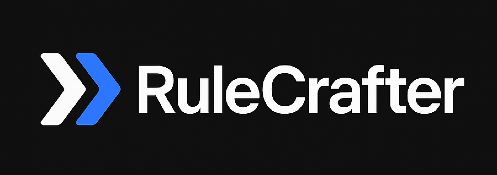

# RuleCrafter

🧠 **Adaptive automation system that learns from your development workflow and generates intelligent rules and commands**

RuleCrafter observes your development patterns, learns from repeated behaviors, and automatically generates:
- **Adaptive rules** for your project memory
- **Custom slash commands** for frequently used workflows  
- **Error prevention guidelines** based on common mistakes

## ✨ Key Features

### 🎯 **Zero-Setup Learning**
- One command setup with automatic hook configuration
- Learns patterns from errors, commands, and file changes
- Generates relevant guidance without manual input

### 🤖 **Smart Rule Generation**
- Creates rules based on actual development patterns
- Focuses on errors you've encountered multiple times
- Suggests workflow improvements from command usage

### ⚡ **Automatic Slash Commands**
- Builds custom commands for repeated tasks
- Templates include testing, debugging, and refactoring workflows
- Adapts to your project's technology stack

### 🛡️ **Safe & Governed**
- All suggestions require user approval
- High-confidence rules can be auto-approved
- Easy review interface for pending suggestions

## 🚀 Quick Start

### Installation

```bash
# Install globally
npm install -g rulecrafter

# Or with pnpm
pnpm add -g rulecrafter
```

### Setup (2 commands, 30 seconds)

```bash
# 1. Navigate to your project
cd /path/to/your/project

# 2. Initialize RuleCrafter (auto-configures everything!)
rulecrafter init
```

**That's it!** RuleCrafter automatically:
- ✅ Creates the `.claude/rulecrafter/` system
- ✅ Generates all hook scripts
- ✅ Configures Claude Code integration
- ✅ Sets up project memory file

### Start Using Normally

Just start coding with Claude Code as usual:

```bash
claude
```

RuleCrafter runs invisibly in the background, learning from:
- Every tool and command you use
- Errors encountered during development
- File patterns and git changes
- Your conversation patterns

After **10 tool uses**, RuleCrafter will start generating suggestions!

## 📊 Monitoring & Management

### Check System Status
```bash
# In Claude Code chat interface
/rulecrafter-status
```

Shows learning progress, auto-generated commands, pending suggestions, and system health.

### Trigger Manual Analysis
```bash
# In Claude Code chat interface  
/rulecrafter-mine

# Or force analysis with limited data
/rulecrafter-mine --force
```

### Review Pending Suggestions
```bash
# In Claude Code chat interface
/rulecrafter-review
```

Interactive interface to view, approve, or reject rule suggestions with confidence scores.

## 🎯 How It Works

### 1. **Automatic Setup**
- `rulecrafter init` creates all necessary files and configurations
- Hooks are automatically registered with Claude Code
- No manual configuration required

### 2. **Background Learning**
RuleCrafter's hooks capture:
- **Pre-tool**: Context before each Claude Code tool runs
- **Post-tool**: Results and success/failure patterns  
- **Session end**: Conversation analysis and pattern mining

### 3. **Smart Analysis**
Every 10 tool uses, RuleCrafter analyzes:
- **Command frequencies**: Which slash commands you use most
- **Error patterns**: Types of errors you encounter repeatedly
- **File types**: Technologies and frameworks in your project
- **Git patterns**: Files you change most often

### 4. **Intelligent Generation**
Based on patterns, generates:
- **Error prevention rules**: "Always use as-const on literal config objects" (after 3+ TS errors)
- **Workflow rules**: "Run tests frequently during development" (after repeated test usage)  
- **Technology-specific rules**: TypeScript, Python, JavaScript best practices
- **Custom commands**: Time-saving slash commands for common workflows

## 📝 Examples

### Auto-Generated Rules

After RuleCrafter observes your patterns:

```markdown
## RuleCrafter Adaptive Rules

### TypeScript  
- Always provide explicit type annotations when TypeScript cannot infer types correctly.
  *Generated from 5 occurrences (confidence: 90%)*

- Verify property names and consider using optional chaining (?.) for potentially undefined objects.
  *Generated from 3 occurrences (confidence: 80%)*

### Development Process
- Run tests frequently during development to catch issues early.
  *Generated from 15 usages (confidence: 85%)*

*Last updated: 2025-07-13 10:30:22*
*Generated by RuleCrafter - 3 adaptive rules*
```

### Auto-Generated Commands

```markdown
## smart_test
Run comprehensive test suite with coverage and automatic snapshot updates.

**Usage:** `/smart_test [pattern]`

# Runs tests with coverage enabled
npm run test -- --coverage --updateSnapshot

# If pattern provided, run specific tests  
if [ -n "$1" ]; then
    npm run test -- --testPathPattern="$1" --coverage --updateSnapshot
fi
```

## 🏗️ Project Structure

After initialization:

```
your-project/
├── .claude/
│   ├── rulecrafter/
│   │   ├── analyzers/           # Pattern analysis scripts
│   │   │   ├── context_analyzer.py
│   │   │   └── convo_analyzer.py
│   │   ├── generators/          # Rule and command generators
│   │   │   ├── rule_generator.py
│   │   │   └── cmd_builder.py
│   │   ├── storage/             # Pattern storage
│   │   │   ├── patterns.json
│   │   │   └── pending_rules.json
│   │   ├── hooks/               # Integration scripts
│   │   │   ├── pre_tool_analyzer.sh
│   │   │   ├── post_tool_learner.sh
│   │   │   └── session_compact.sh
│   │   └── config/              # System configuration
│   │       └── settings.json
│   ├── settings.local.json      # Auto-configured hooks
│   └── commands/
│       ├── rulecrafter-status.md
│       ├── rulecrafter-mine.md
│       ├── rulecrafter-review.md
│       └── auto-generated/      # Your custom commands appear here
└── CLAUDE.md                    # Updated with adaptive rules
```

## ⚙️ Configuration

Customize RuleCrafter behavior in `.claude/rulecrafter/config/settings.json`:

```json
{
  "rulecrafter": {
    "auto_approve_threshold": 0.9,    // Auto-approve rules above 90% confidence
    "pattern_analysis_frequency": 10, // Run analysis every 10 tool uses
    "error_threshold": 3,             // Generate rule after 3+ error occurrences
    "command_threshold": 5,           // Generate command after 5+ usages
    "confidence_threshold": 0.7,      // Minimum confidence for suggestions
    "notifications": {
      "new_rules": true,
      "new_commands": true,
      "analysis_complete": true
    }
  }
}
```

## 🔧 Requirements

- **Node.js** 14+ (for the CLI tool)
- **Python** 3.6+ (for pattern analysis)
- **Claude Code** with hooks support
- **Git repository** (recommended for best pattern detection)

## 🤝 Contributing

We welcome contributions! See our [Build Guide](BUILD.md) for development setup.

### Development Setup

```bash
# Clone the repository
git clone https://github.com/your-username/rulecrafter.git
cd rulecrafter

# Install dependencies
pnpm install

# Link for local development
pnpm link --global

# Test in a project
cd /path/to/test/project
rulecrafter init
```

## 📚 Documentation

- [Build Guide](BUILD.md) - Development and architecture details
- [Planning Document](PLAN.md) - Original design and research

## 🐛 Troubleshooting

### "Command not found" when trying `/rulecrafter-mine`

**Problem:** You're trying to run `/rulecrafter-mine` in your terminal.

**Solution:** These are Claude Code slash commands, not terminal commands. Use them inside Claude Code's chat interface:

✅ **Correct:** Open Claude Code → Type `/rulecrafter-mine` in the chat  
❌ **Incorrect:** Type `/rulecrafter-mine` in your terminal

### RuleCrafter Not Learning
- Check system status: `/rulecrafter-status` in Claude Code
- Verify hooks are working: `rulecrafter verify-hooks` in terminal
- Ensure Python 3 is available: `python3 --version`
- Check that `.claude/rulecrafter` directory was created

### Analysis Not Running
- Ensure you're in a git repository (recommended for best pattern detection)
- Try manual analysis: `/rulecrafter-mine --force` in Claude Code
- Check that patterns.json is being created in `.claude/rulecrafter/storage/`

### Hooks Not Working
- Run `rulecrafter verify-hooks` to check configuration
- Restart Claude Code: exit and run `claude` again
- Check that hook scripts are executable: `ls -la .claude/rulecrafter/hooks/`

## 📄 License

MIT License - see [LICENSE](LICENSE) file for details.

## 🌟 Open Source Community

RuleCrafter is built as an **open source community feature** by **EveryDev.AI** - the social network for developers building with AI.

### 🚀 Connect with AI Developers

Visit **[EveryDev.ai](https://everydev.ai)** to:
- Join a community of developers building with AI tools like Claude Code
- Share your RuleCrafter workflows and adaptive rules
- Discover how other developers are using AI in their projects
- Get support and collaborate on AI-powered development tools

### 🤝 Built by the Community, for the Community

We believe in creating tools that help developers harness AI more effectively. RuleCrafter is just one example of how we can build smarter, more adaptive tooling together.

## 🙏 Acknowledgments

Built with ❤️ by **EveryDev.AI** for developers who want smarter, more adaptive tooling. Special thanks to Anthropic for creating Claude Code with its extensible hooks system.

---

*RuleCrafter learns from your workflow, evolves with your project, and helps you build better software faster.*
